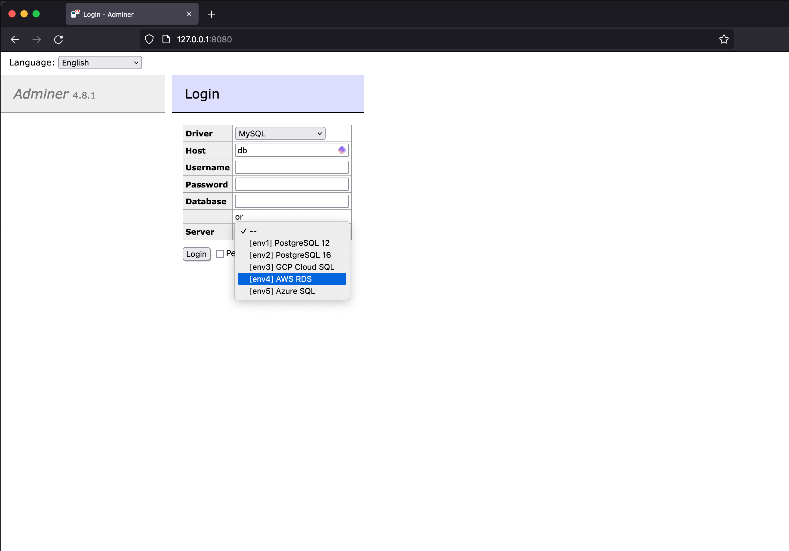

# Adminer Plugin

Adminer plugin to display servers list from defined ADMINER_SERVERS variable in docker compose or .env file.

### Prerequisites
- Docker

### Step 1 - Clone this repository
```bash
git clone git@github.com:garis-space/adminer-login-servers.git
cd adminer-login-servers
```

### Step 2 - Create a .env file
```bash
# Modify the ADMINER_SERVERS variable in the .env file to include your PostgreSQL server details
cp .env.example .env
```

### Step 3 - Start the Adminer and PostgreSQL services
```bash
docker-compose up -d
```

### Step 4 - Access the Adminer
```bash
# Open http://localhost:8080 in your web browser
open https://localhost:8080
```



### `Optional` Modify ADMINER_SERVERS variable
```bash
# Modify the ADMINER_SERVERS variable in the .env file and restart the services
docker-compose restart
```

### `Optional` Customizing the Plugin

You can modify the `adminer/login-servers.php` to add more features or change how the server list is displayed.

The structure of the `ADMINER_SERVERS` variable in the .env file can be adjusted as needed, but ensure it remains JSON-compatible.
